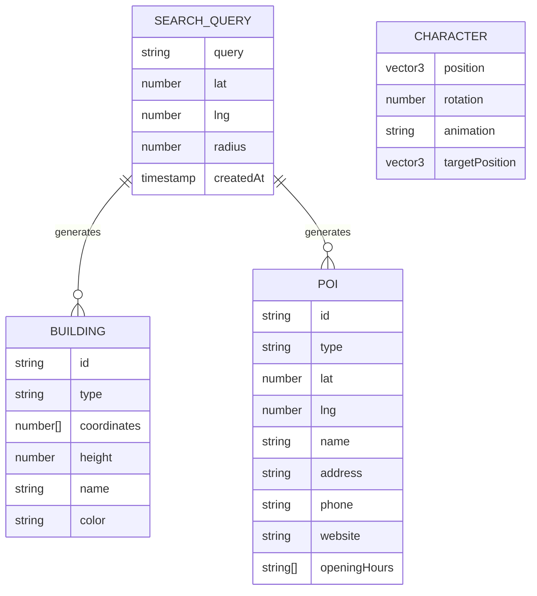

# feat: 귀여운 3D 맵 탐험기 (Cute 3D Map Explorer)

> 구글맵 검색 + 귀여운 로우폴리 3D 월드에서 치비 캐릭터로 탐험하는 React WebGL 앱

---

## Overview

지도 검색으로 실제 도시 데이터를 가져와서 귀여운 로우폴리 스타일의 3D 월드로 변환하고, 2등신 치비 캐릭터로 돌아다니며 탐험하는 웹 앱.

```
┌─────────────────────────────────────────────────────────────┐
│  🔍 검색: 강남역                              [🏠] [📍]    │
├─────────────────────────────────────────────────────────────┤
│                                                             │
│     🌙 ⭐                     ☁️                           │
│                    🏢                                       │
│         🏪       🏢🏢    🌳                                 │
│    🚇 ━━━━━━━━━━━━━━━━━━━━━━━━                             │
│         🍜  🧑  🏬      🚌                                  │
│              ↑                                              │
│           캐릭터                                            │
│                                                             │
├─────────────────────────────────────────────────────────────┤
│  [강남역] 지하철 2호선 · 신분당선  |  영업 중              │
│  ➡️ 여기로 이동                                            │
└─────────────────────────────────────────────────────────────┘
```

---

## Problem Statement / Motivation

- 기존 지도 앱은 실용적이지만 탐험하는 재미가 없음
- 게임처럼 돌아다니면서 동네를 탐험하고 싶다는 니즈
- 귀여운 아트 스타일로 친숙하고 부담 없는 UX 제공

---

## Proposed Solution

### 핵심 기능

1. **검색 기반 월드 생성**: 텍스트 검색 → Geocoding → OSM 데이터 → 3D 월드
2. **치비 캐릭터 탐험**: WASD + 마우스 클릭으로 이동, 부드러운 애니메이션
3. **POI 인터랙션**: 건물/가게 클릭 시 정보 패널, "여기로 이동" 기능
4. **귀여운 비주얼**: 로우폴리 건물, 야경 테마, 별/달 장식

---

## Technical Approach

### Architecture

```
┌──────────────────────────────────────────────────────────────┐
│                        React App                             │
├──────────────────────────────────────────────────────────────┤
│  ┌─────────────┐  ┌─────────────┐  ┌─────────────────────┐  │
│  │ Search Bar  │  │ Info Panel  │  │    3D Canvas        │  │
│  │ (Geocoding) │  │ (POI Data)  │  │ (React Three Fiber) │  │
│  └──────┬──────┘  └──────┬──────┘  └──────────┬──────────┘  │
│         │                │                     │             │
│  ┌──────▼────────────────▼─────────────────────▼──────────┐ │
│  │                    Zustand Store                        │ │
│  │  ┌──────────┐ ┌──────────┐ ┌──────────┐ ┌───────────┐  │ │
│  │  │ mapSlice │ │charSlice │ │ uiSlice  │ │inputSlice │  │ │
│  │  └──────────┘ └──────────┘ └──────────┘ └───────────┘  │ │
│  └─────────────────────────────────────────────────────────┘ │
├──────────────────────────────────────────────────────────────┤
│  ┌───────────────┐  ┌───────────────┐  ┌─────────────────┐  │
│  │ Nominatim API │  │ Overpass API  │  │   GLTF Assets   │  │
│  │  (Geocoding)  │  │  (OSM Data)   │  │ (3D Models)     │  │
│  └───────────────┘  └───────────────┘  └─────────────────┘  │
└──────────────────────────────────────────────────────────────┘
```

### Tech Stack

| Layer | Technology | Version |
|-------|------------|---------|
| Framework | React + TypeScript | ^19.0.0 |
| Build | Vite | ^7.x |
| 3D Renderer | @react-three/fiber | ^9.0.0 |
| 3D Helpers | @react-three/drei | ^9.100.0 |
| Physics | @react-three/rapier | ^1.4.0 |
| Character Controller | ecctrl | ^1.x |
| State | Zustand | ^5.x |
| Validation | Zod | ^3.x |
| Styling | Tailwind CSS | ^4.x |
| UI Components | shadcn/ui | - |

### 데이터 흐름

```
1. User searches "강남역"
   ↓
2. Nominatim geocodes → { lat: 37.498, lng: 127.028 }
   ↓
3. Calculate bounding box (500m radius)
   ↓
4. Overpass API query for buildings, POIs
   ↓
5. Parse OSM response → TypeScript objects
   ↓
6. Generate Three.js geometries + Rapier colliders
   ↓
7. Spawn character at center
   ↓
8. User explores with WASD/click
```

---

## Implementation Phases

### Phase 1: Project Setup & Basic 3D Scene (MVP)

**목표**: 빈 3D 씬에 캐릭터가 돌아다니는 것까지

#### Tasks

- [ ] Vite + React + TypeScript 프로젝트 초기화
  - `vite.config.ts` - Tailwind v4, path aliases
  - `tsconfig.json` - strict mode
  - `.prettierrc`, `eslint.config.js`

- [ ] 기본 폴더 구조 생성
  ```
  src/
  ├── components/
  │   ├── 3d/           # Three.js components
  │   │   ├── Canvas.tsx
  │   │   ├── Ground.tsx
  │   │   ├── Character.tsx
  │   │   └── FollowCamera.tsx
  │   └── ui/           # React UI components
  │       ├── SearchBar.tsx
  │       └── InfoPanel.tsx
  ├── stores/
  │   ├── index.ts
  │   └── slices/
  ├── hooks/
  ├── utils/
  ├── types/
  └── assets/
      └── models/
  ```

- [ ] 핵심 의존성 설치
  ```bash
  npm i @react-three/fiber @react-three/drei @react-three/rapier three zustand ecctrl zod
  npm i -D @types/three vitest @testing-library/react
  ```

- [ ] **에러 바운더리 설정** (Kieran 피드백)
  - `components/ErrorBoundary.tsx` - 3D 씬 크래시 방지
  - `components/3d/SceneErrorBoundary.tsx` - Three.js 전용
  ```tsx
  <ErrorBoundary fallback={<SceneErrorFallback />}>
    <Canvas>...</Canvas>
  </ErrorBoundary>
  ```

- [ ] **도메인 타입 정의** (Kieran 피드백)
  - `types/coordinates.ts` - WGS84, LocalXZ 타입 분리
  - `types/building.ts` - 엄격한 Building 타입
  - `types/poi.ts` - 타입별 POI discriminated union
  ```typescript
  // types/coordinates.ts
  export type WGS84 = { lat: number; lng: number };
  export type LocalXZ = { x: number; z: number };

  // types/building.ts
  export type BuildingType = 'residential' | 'commercial' | 'retail' | 'industrial';
  export interface Building {
    readonly id: string;
    readonly type: BuildingType;
    readonly footprint: readonly LocalXZ[];
    readonly height: number;
  }
  ```

- [ ] 기본 3D Canvas 설정
  - `components/3d/Canvas.tsx` - R3F Canvas with Physics
  - `components/3d/Ground.tsx` - 바닥면 (grid 텍스처)
  - `components/3d/Lighting.tsx` - ambient + directional light

- [ ] 캐릭터 컨트롤러 구현
  - `components/3d/Character.tsx` - ecctrl wrapper
  - WASD 이동 + 마우스 클릭 이동
  - 기본 박스 메쉬로 placeholder

- [ ] 카메라 팔로우 구현
  - `components/3d/FollowCamera.tsx` - 3인칭 카메라

**Deliverables**:
- 회색 바닥에 박스 캐릭터가 돌아다니는 데모
- WASD + 클릭 네비게이션 작동

**예상 소요**: 2-3일

---

### Phase 2: Map Data Integration

**목표**: 검색 → OSM 데이터 → 3D 건물 생성

#### Tasks

- [ ] Geocoding 서비스 연동
  - `lib/geocoding.ts` - Nominatim API wrapper
  - Rate limiting (1 req/sec)
  - 한글/영문 검색 지원

- [ ] Overpass API 연동
  - `lib/overpass.ts` - Query builder
  - `utils/osmParser.ts` - GeoJSON 파싱
  - 쿼리 타입: buildings, amenities (restaurant, cafe, park...), stations

- [ ] **Zod 런타임 검증** (Kieran 피드백)
  - `lib/schemas.ts` - OSM 응답 스키마
  ```typescript
  import { z } from 'zod';

  export const osmBuildingSchema = z.object({
    type: z.literal('way'),
    id: z.number(),
    tags: z.object({
      building: z.string().optional(),
      height: z.string().optional(),
      'building:levels': z.string().optional(),
    }).passthrough(),
    nodes: z.array(z.number()),
  });

  export const overpassResponseSchema = z.object({
    elements: z.array(z.union([osmBuildingSchema, osmNodeSchema])),
  });
  ```

- [ ] OSM → 3D 변환 (Kieran 피드백: 단일책임 분리)
  - `utils/coordinates.ts` - 순수 좌표 변환 함수
  - `utils/geometry.ts` - Three.js 지오메트리 빌더
  - `utils/osmTo3D.ts` - 파이프라인 조합
  - 건물 폴리곤 → ExtrudeGeometry
  - POI 마커 위치 계산

- [ ] 기본 건물 렌더링
  - `components/3d/Building.tsx` - 단일 건물
  - `components/3d/Buildings.tsx` - Instanced mesh로 최적화
  - 높이: `height` tag 또는 `building:levels * 3`

- [ ] Zustand 스토어 설계
  - `stores/slices/mapSlice.ts` - buildings, pois, center
  - `stores/slices/searchSlice.ts` - query, loading, error

- [ ] **메모이즈드 셀렉터 패턴** (Kieran 피드백)
  - `stores/selectors.ts` - 최적화된 셀렉터
  ```typescript
  // 불필요한 리렌더 방지
  export const selectBuildings = (state: StoreState) => state.buildings;
  export const selectCharacterPosition = (state: StoreState) => state.character.position;

  // 파생 상태 (가장 가까운 POI 등)
  export const selectNearestPOI = createSelector(
    [selectPOIs, selectCharacterPosition],
    (pois, position) => findNearest(pois, position)
  );
  ```

- [ ] 검색 UI
  - `components/ui/SearchBar.tsx` - 입력 + 엔터 검색
  - 로딩 인디케이터
  - 에러 토스트

**Deliverables**:
- "강남역" 검색 → 실제 건물 박스들 렌더링
- 캐릭터가 건물 사이 돌아다님

**예상 소요**: 3-4일

---

### Phase 3: Cute Visual Style

**목표**: 로우폴리 귀여운 비주얼

#### Tasks

- [ ] 치비 캐릭터 모델
  - Sketchfab/poly.pizza에서 무료 치비 GLTF 획득
  - 필수 애니메이션: idle, walk, run
  - `components/3d/ChibiCharacter.tsx` - useGLTF + useAnimations

- [ ] 건물 타입별 스타일
  - `constants/buildingStyles.ts` - OSM tag → 색상/높이 매핑
  ```typescript
  const BUILDING_COLORS = {
    residential: '#FFB5BA',  // 파스텔 핑크
    commercial: '#B5D8FF',   // 파스텔 블루
    retail: '#FFE5B5',       // 파스텔 옐로우
    default: '#E8E8E8',
  };
  ```

- [ ] POI 마커 모델
  - 음식점: 🍜 밥그릇 모양
  - 카페: ☕ 컵 모양
  - 지하철: 🚇 M 마크
  - 버스: 🚌 버스 아이콘
  - poly.pizza 또는 Kenney Assets 활용

- [ ] 환경 연출
  - 야경 테마: 어두운 배경, 건물 창문 라이트
  - `components/3d/Sky.tsx` - 달, 별 장식
  - `components/3d/StreetLights.tsx` - 가로등 (옵션)

- [ ] 후처리 효과
  - `@react-three/postprocessing`
  - Bloom 효과 (건물 창문 glow)
  - Vignette (화면 가장자리 어둡게)

**Deliverables**:
- 귀여운 치비 캐릭터 애니메이션
- 파스텔 톤 건물들
- 야경 분위기 연출

**예상 소요**: 4-5일

---

### Phase 4: POI Interaction

**목표**: 건물 클릭 → 정보 표시 → 이동

#### Tasks

- [ ] 클릭 감지 시스템
  - `hooks/useClickTarget.ts` - Raycaster 기반
  - Ground 클릭 = 이동
  - POI 클릭 = 정보 패널

- [ ] POI 정보 패널
  - `components/ui/InfoPanel.tsx` - shadcn Card
  - 이름, 타입, 주소 (OSM 데이터)
  - "여기로 이동" 버튼

- [ ] 이동 시스템
  - `stores/slices/characterSlice.ts` - targetPosition
  - 클릭 위치로 캐릭터 이동 (ecctrl PointToMove)

- [ ] 호버 효과
  - POI 마우스 오버 시 하이라이트
  - 이름 툴팁 표시

**Deliverables**:
- 건물/POI 클릭 시 정보 패널
- "여기로 이동" 작동

**예상 소요**: 2-3일

---

### Phase 5: Polish & Optimization

**목표**: 성능 최적화 + UX 개선

#### Tasks

- [ ] 성능 최적화
  - Instanced Mesh로 동일 건물 그룹화
  - LOD (Level of Detail) - 먼 건물은 단순화
  - Frustum culling 확인
  - `r3f-perf`로 FPS 모니터링

- [ ] 월드 경계 처리
  - 맵 가장자리 안개 효과
  - 보이지 않는 벽 (RigidBody)

- [ ] 로딩 경험
  - 스켈레톤 로더
  - 월드 전환 애니메이션 (fade)

- [ ] 에러 핸들링
  - Overpass 타임아웃 재시도
  - "검색 결과 없음" UI
  - 네트워크 오류 토스트

- [ ] 반응형 UI
  - 모바일 터치 지원 (옵션)
  - 화면 크기별 UI 조정

**Deliverables**:
- 60fps 안정적 유지
- 에러 상황 대응 완료

**예상 소요**: 3-4일

---

## Alternative Approaches Considered

### 1. Babylon.js vs React Three Fiber

| 기준 | Babylon.js | React Three Fiber |
|------|------------|-------------------|
| React 통합 | 어댑터 필요 | 네이티브 |
| 학습 곡선 | 더 쉬움 | React 경험 필요 |
| 생태계 | 자체 완결 | pmndrs 생태계 |
| **선택** | - | ✅ React 프로젝트에 적합 |

### 2. 캐릭터 컨트롤러

| 옵션 | 장점 | 단점 | 선택 |
|------|------|------|------|
| ecctrl | 즉시 사용, 애니메이션 연동 | 커스텀 제한 | ✅ |
| 직접 구현 | 완전한 제어 | 시간 소요 | - |
| use-cannon | 간단한 물리 | 덜 유지보수 | - |

### 3. 지도 데이터 소스

| API | 비용 | 데이터 품질 | 선택 |
|-----|------|------------|------|
| Overpass (OSM) | 무료 | 지역별 상이 | ✅ Phase 1 |
| Google Places | 유료 | 높음 | 추후 옵션 |
| Mapbox | 프리티어 | 높음 | 추후 옵션 |

---

## Acceptance Criteria

### Functional Requirements

- [ ] 검색창에 한글/영문 지명 입력 시 해당 위치의 3D 월드 생성
- [ ] WASD 키로 캐릭터 전후좌우 이동
- [ ] 마우스 클릭으로 해당 위치로 캐릭터 이동
- [ ] 캐릭터 이동 시 idle ↔ walk 애니메이션 전환
- [ ] 카메라가 캐릭터를 부드럽게 따라감
- [ ] 건물 충돌 시 통과하지 않음
- [ ] POI(음식점, 지하철 등) 클릭 시 정보 패널 표시
- [ ] "여기로 이동" 클릭 시 캐릭터가 해당 위치로 이동

### Non-Functional Requirements

- [ ] 60fps 유지 (1000개 건물 기준)
- [ ] 초기 로딩 3초 이내
- [ ] Chrome, Safari, Firefox 최신 버전 지원
- [ ] 모바일 뷰포트에서 UI 깨지지 않음

### Quality Gates

- [ ] TypeScript strict mode 에러 없음
- [ ] ESLint 경고 없음
- [ ] 주요 컴포넌트 단위 테스트

### 테스트 전략 (Kieran 피드백)

| 레이어 | 테스트 방법 | 도구 |
|--------|------------|------|
| 좌표 변환 (`utils/coordinates.ts`) | 단위 테스트 | Vitest |
| Zod 스키마 (`lib/schemas.ts`) | 단위 테스트 | Vitest |
| Zustand 스토어 | 통합 테스트 | Vitest |
| 3D 컴포넌트 | 수동 테스트 | 브라우저 |
| API 연동 | Mock 테스트 | MSW |

```typescript
// __tests__/coordinates.test.ts
import { describe, it, expect } from 'vitest';
import { wgs84ToLocalXZ } from '@/utils/coordinates';

describe('wgs84ToLocalXZ', () => {
  it('should convert center point to origin', () => {
    const center = { lat: 37.5, lng: 127.0 };
    const result = wgs84ToLocalXZ({ lat: 37.5, lng: 127.0 }, center);
    expect(result).toEqual({ x: 0, z: 0 });
  });
});
```

---

## Success Metrics

| 지표 | 목표 |
|------|------|
| 첫 검색 → 월드 렌더링 | < 5초 |
| 프레임 레이트 | 60fps 평균 |
| 번들 사이즈 | < 500KB (gzip) |
| Lighthouse Performance | > 80 |

---

## Dependencies & Prerequisites

### 필수

1. **Node.js 20+** - Vite 7 요구사항
2. **브라우저 WebGL 2.0 지원** - Three.js r150+
3. **Nominatim API 접근** - 무료, rate limit 1 req/sec
4. **Overpass API 접근** - 무료, rate limit 존재

### 외부 에셋 (획득 필요)

| 에셋 | 소스 | 라이선스 |
|------|------|----------|
| 치비 캐릭터 GLTF | [Sketchfab](https://sketchfab.com/3d-models/free-pack-chibi-base-mesh-rigged) | CC BY 4.0 |
| POI 아이콘 모델 | [Kenney](https://kenney.nl/assets) | CC0 |
| 건물 텍스처 | 직접 제작 또는 무료 소스 | - |

---

## Risk Analysis & Mitigation

| 리스크 | 확률 | 영향 | 완화 방안 |
|--------|------|------|----------|
| Overpass API rate limit | 높음 | 중간 | 클라이언트 캐싱, 서버 프록시 검토 |
| OSM 데이터 불완전 | 중간 | 중간 | 기본 건물 모델 폴백 |
| 치비 캐릭터 애니메이션 호환성 | 중간 | 높음 | 사전 테스트, 리깅 수정 대비 |
| 모바일 성능 | 높음 | 낮음 | MVP는 데스크톱 우선, 모바일은 후순위 |
| 한글 Geocoding 정확도 | 중간 | 중간 | Nominatim 외 Kakao Local API 검토 |

---

## Documentation Plan

- [ ] `CLAUDE.md` - 프로젝트 컨벤션, 아키텍처
- [ ] `README.md` - 설치, 실행 방법
- [ ] 코드 내 JSDoc 주석 (주요 함수)

### 좌표 시스템 문서화 (Kieran 피드백 - CLAUDE.md에 포함)

```markdown
## Coordinate Systems

맵 프로젝트에서 가장 흔한 버그 원인은 좌표 혼동입니다.

1. **WGS84**: API에서 오는 원본 좌표
   - 타입: `{ lat: number; lng: number }`
   - 예: `{ lat: 37.498, lng: 127.028 }`

2. **LocalXZ**: Three.js 씬 좌표
   - 타입: `{ x: number; z: number }`
   - Origin = 검색 중심점
   - 1 unit = 1 meter

3. **Screen**: 레이캐스팅용 NDC
   - 범위: -1 ~ 1

변환: WGS84 → LocalXZ는 `utils/coordinates.ts`에서만 수행
```

---

## Open Questions (요결정 사항)

### Priority 1 - 결정 필요

1. **기본 위치**: 앱 첫 로드 시 어디를 보여줄까?
   - 추천: 광화문 (37.576, 126.977) - 한글 환경 + OSM 데이터 풍부

2. **Bounding Box 크기**: 검색당 얼마나 넓은 범위?
   - 추천: 500m 반경 (성능과 탐험 밸런스)

3. **점프 기능**: Space로 점프 가능하게 할까?
   - 추천: 비활성화 (현실적인 도시 탐험 컨셉)

### Priority 2 - 구현 중 결정 가능

4. 건물 높이 데이터 없을 때 기본값?
   - 추천: `building:levels * 3m` 또는 랜덤 6-15m

5. 캐릭터 속도?
   - 추천: 실제의 3-5배 (5-7 m/s)

6. 타일 로딩 (월드 확장)?
   - Phase 1은 고정 경계, 추후 검토

---

## References & Research

### Internal References

- 형제 프로젝트 패턴: `/Users/kyb-ontact/sonix/toy/250223/` (Konva + Zustand)
- 형제 프로젝트 CLAUDE.md: `/Users/kyb-ontact/sonix/toy/nihongo-app/CLAUDE.md`

### External References

- [React Three Fiber v9 Docs](https://r3f.docs.pmnd.rs/)
- [Drei Helpers](https://drei.docs.pmnd.rs/)
- [ecctrl Character Controller](https://github.com/pmndrs/ecctrl)
- [Overpass API Wiki](https://wiki.openstreetmap.org/wiki/Overpass_API)
- [Nominatim Search API](https://nominatim.org/release-docs/latest/api/Search/)
- [OSM Building Tags](https://wiki.openstreetmap.org/wiki/Key:building)

### Asset Sources

- [poly.pizza](https://poly.pizza/) - 무료 로우폴리 모델
- [Kenney Assets](https://kenney.nl/assets) - 게임 에셋 CC0
- [Sketchfab Chibi](https://sketchfab.com/3d-models/free-pack-chibi-base-mesh-rigged) - 리깅된 치비 베이스

---

## ERD (데이터 모델)



---

## MVP 파일 구조

### src/components/ErrorBoundary.tsx (Kieran 피드백)

```tsx
import { Component, ReactNode } from 'react';

interface Props {
  children: ReactNode;
  fallback: ReactNode;
}

interface State {
  hasError: boolean;
}

export class ErrorBoundary extends Component<Props, State> {
  state: State = { hasError: false };

  static getDerivedStateFromError(): State {
    return { hasError: true };
  }

  componentDidCatch(error: Error) {
    console.error('3D Scene Error:', error);
  }

  render() {
    if (this.state.hasError) {
      return this.props.fallback;
    }
    return this.props.children;
  }
}
```

### src/components/3d/GameCanvas.tsx (Kieran 피드백: 분리된 구조)

```tsx
import { Canvas } from '@react-three/fiber';
import { KeyboardControls } from '@react-three/drei';
import { Suspense } from 'react';
import { ErrorBoundary } from '../ErrorBoundary';
import { World } from './World';
import { LoadingScene } from './LoadingScene';

const keyboardMap = [
  { name: 'forward', keys: ['ArrowUp', 'KeyW'] },
  { name: 'backward', keys: ['ArrowDown', 'KeyS'] },
  { name: 'leftward', keys: ['ArrowLeft', 'KeyA'] },
  { name: 'rightward', keys: ['ArrowRight', 'KeyD'] },
];

export function GameCanvas() {
  return (
    <ErrorBoundary fallback={<div>3D 씬 로딩 실패. 새로고침해주세요.</div>}>
      <KeyboardControls map={keyboardMap}>
        <Canvas camera={{ position: [0, 10, 15], fov: 50 }}>
          <Suspense fallback={<LoadingScene />}>
            <World />
          </Suspense>
        </Canvas>
      </KeyboardControls>
    </ErrorBoundary>
  );
}
```

### src/components/3d/World.tsx (Kieran 피드백: 씬 구성 분리)

```tsx
import { Physics } from '@react-three/rapier';
import { Character } from './Character';
import { Ground } from './Ground';
import { Buildings } from './Buildings';
import { Sky } from './Sky';
import { Environment } from './Environment';

export function World() {
  return (
    <Physics debug={import.meta.env.DEV}>
      <Environment />
      <Sky />
      <Ground />
      <Buildings />
      <Character />
    </Physics>
  );
}
```

### src/stores/slices/mapSlice.ts (Kieran 피드백: 타입 안전성)

```tsx
import { StateCreator } from 'zustand';
import type { Building, POI, WGS84 } from '@/types';
import type { StoreState } from '../index';

export interface MapSlice {
  center: WGS84 | null;
  buildings: readonly Building[];
  pois: readonly POI[];
  isLoading: boolean;
  error: string | null;

  setCenter: (center: WGS84) => void;
  setBuildings: (buildings: readonly Building[]) => void;
  setPOIs: (pois: readonly POI[]) => void;
  setLoading: (loading: boolean) => void;
  setError: (error: string | null) => void;
}

// Kieran 피드백: 슬라이스 결합 시 타입 추론 유지
export const createMapSlice: StateCreator<
  StoreState,
  [],
  [],
  MapSlice
> = (set) => ({
  center: null,
  buildings: [],
  pois: [],
  isLoading: false,
  error: null,

  setCenter: (center) => set({ center }),
  setBuildings: (buildings) => set({ buildings }),
  setPOIs: (pois) => set({ pois }),
  setLoading: (isLoading) => set({ isLoading }),
  setError: (error) => set({ error }),
});
```

### src/lib/overpass.ts

```tsx
const OVERPASS_API = 'https://overpass-api.de/api/interpreter';

export async function fetchMapData(lat: number, lng: number, radius: number = 500) {
  const bbox = calculateBbox(lat, lng, radius);

  const query = `
    [out:json][timeout:25];
    (
      way["building"](${bbox});
      node["amenity"~"restaurant|cafe|bar"](${bbox});
      node["railway"="station"](${bbox});
      node["highway"="bus_stop"](${bbox});
    );
    out body;
    >;
    out skel qt;
  `;

  const response = await fetch(OVERPASS_API, {
    method: 'POST',
    body: `data=${encodeURIComponent(query)}`,
    headers: { 'Content-Type': 'application/x-www-form-urlencoded' },
  });

  if (!response.ok) throw new Error('Overpass API error');
  return response.json();
}

function calculateBbox(lat: number, lng: number, radius: number) {
  const latDelta = radius / 111320;
  const lngDelta = radius / (111320 * Math.cos(lat * Math.PI / 180));
  return `${lat - latDelta},${lng - lngDelta},${lat + latDelta},${lng + lngDelta}`;
}
```

---

## Review Feedback Applied

| 리뷰어 | 반영 사항 |
|--------|----------|
| **Kieran** (Rails Reviewer) | Zod 런타임 검증, 에러 바운더리, 타입 강화, 셀렉터 패턴, 테스트 전략, 좌표 시스템 문서화 |
| DHH | 참고: 스코프 단순화는 추후 검토 |
| Simplicity | 참고: 고정 씬 대안은 v2 옵션 |

---

*Plan created: 2026-02-27*
*Plan updated: 2026-02-27 (Kieran 피드백 반영)*
*Author: Claude Code*
